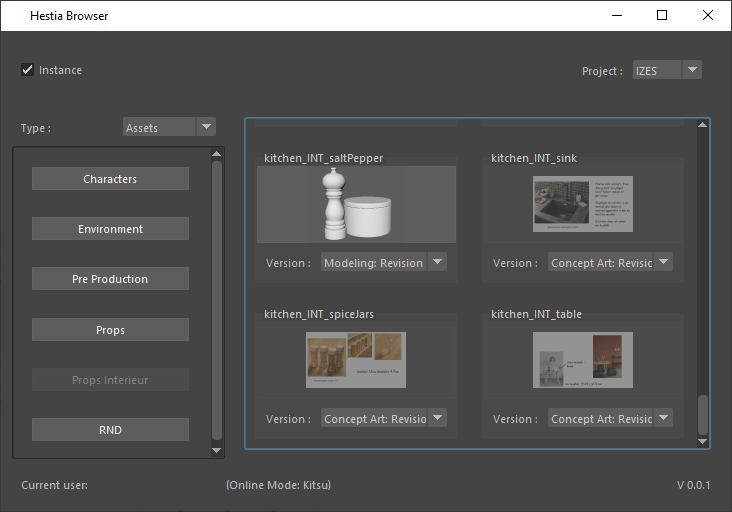

# Hestia
**Project in active development! Please don't use it in production.**

An assets browser and a shot assembly system for CGI/VFX productions.

 

## Getting Started

These instructions will get you a copy of the project up and running on your local machine for development and testing purposes.

### Prerequisites

You can download stable versions in github release or clone the repository.

```
git clone https://github.com/PiloeGAO/Hestia.git
```

## Installation

1. Create a virtual environment for Python2.7 or Python 3.8.

2. Use the package manager [pip](https://pip.pypa.io/en/stable/) to install libraries.

For Python 2.7 [**Deprecated**]:
```bash
pip install -r requirements2.txt
```

For Python 3.8:
```bash
pip install -r requirements3.txt
```

## Usage

Start the standalone app with this command:
```bash
cd ./Hestia
python __init__.py
```

## Roadmap

- Links to projects managers:
    - [ ] Local Folders
    - [x] Kitsu (Only for the Asset Browser)
- Assets Browser:
    - [x] Maya 2020
    - [ ] Houdini
    - [ ] Blender 2.83+
    - [ ] Guerilla Render
- Shot Assembly:
    - [ ] Designing the main system


## Contributing
Pull requests are welcome. For major changes, please open an issue first to discuss what you would like to change.

## Versioning

We use [SemVer](http://semver.org/) for versioning. For the versions available, see the [tags on this repository](https://github.com/your/project/tags). 

## Authors

* **Léo DEPOIX** - *Initial work* - [PiloeGAO](https://github.com/PiloeGAO)

See also the list of [contributors](https://github.com/your/project/contributors) who participated in this project.

## License

This project is licensed under the MIT License - see the [LICENSE.md](LICENSE.md) file for details

## Acknowledgments

* IZES Team for testing this tool in production, making constructive feedback and breaking it.
* [Pôle 3D](https://pole3d.com) teachers.