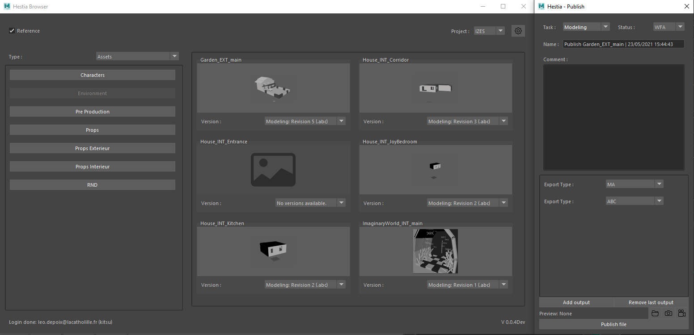

# Hestia
**Project in active development! Please don't use it in production.**
**Python 2.7+ is no longer supported, please use Python 3.7+.**

A production management system for CGI/VFX productions.



## FEATURES
- [x] Mostly implemented Kitsu link.
- [x] Preferences system to store login credentials.
- [x] Maya integration with Asset import/reference system.
- [x] Maya scene setup.
- [x] Basic publish system.

## Getting Started

These instructions will get you a copy of the project up and running on your local machine for development and testing purposes.

### Prerequisites

You can download stable versions in github release or clone the repository.

```
git clone https://github.com/PiloeGAO/Hestia.git
```

Download pre-build binaries for [FFMPEG](https://www.ffmpeg.org/) (Needed for playblast publishing - Only available for Windows).

## Installation

1. Create a virtual environment for Python 3.7+.

2. Use the package manager [pip](https://pip.pypa.io/en/stable/) to install libraries.

```bash
pip install -r requirements3.txt
```

3. Create a folder "ffmpeg" inside of "./Hestia/core" and copy ffmpeg files inside.

## Usage

Start the standalone app with this command:
```bash
cd ./Hestia
python __init__.py
```

To open the browser inside of Maya please add the following lines to your Maya.env:
```bash
PYTHONPATH = ;%hestiaInstallPath%\Hestia;%hestiaInstallPath%\Hestia\Hestia\dccs\maya\scripts;%yourVirtualEnvPath%\Lib\site-packages;
```
Please change %hestiaInstallPath% with the correct install path.
For the %yourVirtualEnvPath%, please follow instructions from the Installation category.
## Roadmap

Trello Board (with releases notes): https://trello.com/b/90POyZZC/hestia-dev-board

- Links to projects managers:
    - [ ] Local Folders
    - [x] Kitsu (Only for the Asset Browser - Shot assembly is WIP)
- Assets Browser:
    - [x] Maya 2022+ [Currently in development]
    - [ ] Houdini 
    - [ ] Blender 2.93+
    - [ ] Guerilla Render [Currently in development]
- Shot Assembly:
    - [x] Shot setup for Maya
    - [x] Designing the main system
    - [ ] Building the HSHOT file exporter
    - [ ] Building the HSHOT file importer
- Publish System:
    - [x] Basic publish system to Kitsu.
    - [x] Take screenshot/playblast directly inside of Maya.

## Contributing
Pull requests are welcome. For major changes, please open an issue first to discuss what you would like to change.

## Versioning

We use [SemVer](http://semver.org/) for versioning. For the versions available, see the [tags on this repository](https://github.com/your/project/tags). 

## Authors

* **Léo DEPOIX** - *Initial work* - [PiloeGAO](https://github.com/PiloeGAO)

See also the list of [contributors](https://github.com/your/project/contributors) who participated in this project.

## License

This project is licensed under the MIT License - see the [LICENSE.md](LICENSE.md) file for details

## Acknowledgments

* IZES Team for testing this tool in production, making constructive feedback and breaking it.
* [Pôle 3D](https://pole3d.com) teachers.